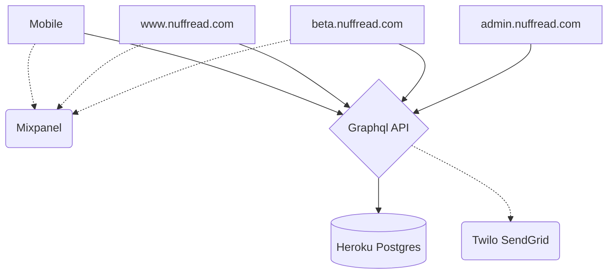

import { Image } from "astro:assets";
import nuffread from "../img/nuffread.png";
import nuffread2 from "../img/nuffread-2.png";

<Image src={nuffread} alt="nuffread.com" transition:name="image" />

## Overview

Textbook costs amount to a significant part of the cost of higher education.
College students on a tight budget often resort to buying used textbooks from
other students. There was a need for a marketplace purpose-built and dedicated
to facilitating exchage books. We created [nuffread.com](https://www.nuffread.com)
to solve this specific need.

## Architecture

[nuffread.com](https://www.nuffread.com) is an on-going project built as
multiple clients sharing a [Graphql](https://graphql.org/) API on top of a
PostgreSQL database all written in [TypeScript](https://www.typescriptlang.org/).

I built the legacy prototype with [Ionic React](https://ionicframework.com/)
as an client-side rendered SPA. We set the goal to have a prototype built before
Spring 2020. I used Ionic React because of out time-to-market requirement. The
legacy web client is built and deployed with [Netlify](https://netlify.com/).

<Image src={nuffread2} alt="nuffread.com" />

I knew Ionic React would not be a good long-term solution. In Summer 2021 I began
the process of porting the web client over to a [Next.js](https://nextjs.org/)
server-side rendered application styled with [Tailwind CSS](https://tailwindcss.com/)
and deployed to [Vercel](https://vercel.com/). I also built a administrative
backend client with the same stack.

The backend is composed of a Graphql API built with [Apollo Server](https://www.apollographql.com/)
with PostgreSQL as a datastore deployed to [Heroku](https://heroku.com/).
We use [SendGrid](https://sendgrid.com/) as our email and text message delivery
service. The API implements subscriptions needed for the instant messaging
feature. For now subscriptions rely on an in-memory Pub/Sub engine. As we grow,
we'll look at moving at either [RabbitMQ](https://www.rabbitmq.com/)
or [Google Cloud Pub/Sub](https://cloud.google.com/pubsub/) depending on our needs.
